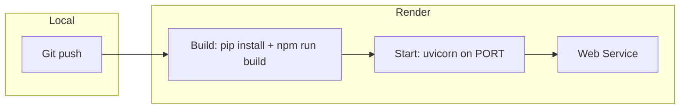

# Deployment Approach: AI-Powered Deal Evaluation System

## Platform comparison and recommendation


| Concern                               | Render                                                                           | Heroku                             | Vercel                                        |
| ------------------------------------- | -------------------------------------------------------------------------------- | ---------------------------------- | --------------------------------------------- |
| **Python long-running process**       | Yes (Web Service)                                                                | Yes (dyno)                         | No (serverless only; 10–60s limits)           |
| **WebSockets**                        | Supported                                                                        | Supported                          | Not for long-lived app connections            |
| **Background job (thread + polling)** | Same process OK                                                                  | Same process OK                    | Does not fit; serverless is request-scoped    |
| **Persistent filesystem**             | Ephemeral by default; [Persistent Disk](https://render.com/docs/disks) available | Ephemeral; add-ons for persistence | Ephemeral; no persistent disk                 |
| **Free / low-cost tier**              | Free tier for web services                                                       | Paid only (no free dynos)          | Free for serverless; wrong model for this app |
| **Config (build/start)**              | `render.yaml` or dashboard                                                       | `Procfile` + dashboard             | `vercel.json`; optimized for serverless       |
| **Ease of deploy**                    | Git push or connect repo; set env; done                                          | Git push; set env; similar         | Git push; but app architecture does not fit   |


**Recommendation: Render** — Best fit and easiest for this app because:

1. **Architecture match**: The app is a single FastAPI process that holds in-memory state (`active_jobs`, `DealAgentFramework`), runs long-lived WebSocket connections (`/ws/logs`), and triggers background work in the same process. Render (and Heroku) run a long-lived container; Vercel runs short-lived serverless functions, so this pattern does not fit without a major re-architecture.
2. **WebSockets**: Render supports WebSockets on the same service; the frontend’s live logs will work without change.
3. **Simplicity**: One “Web Service” that runs the Python app and serves the built React app (same as local). No need to split frontend/backend across two products.
4. **Cost**: Free tier available for web services; Heroku no longer offers free dynos.
5. **Optional persistence**: When you need to keep `chroma_db` and `data/memory.json` across deploys, Render’s Persistent Disk can be attached with minimal path changes.

**Heroku** is a valid alternative if you prefer it (same “one dyno runs FastAPI + static” model); use a Procfile and set `PORT` and env vars. No free tier.

**Vercel** is not recommended for this project without re-architecture: you would need to move ChromaDB and memory to an external store, run workers elsewhere for long jobs, and either give up or reimplement WebSocket-based logs. That goes beyond “minimal changes.”

---

## What the app needs at runtime (unchanged)

- **Port**: Platform sets `PORT`; app must listen on it.
- **CWD**: Process must start from **repo root** so `main.py`, `frontend/build`, `models/`, and paths derived from `Path(__file__).parent.parent.parent` ([deal_agent_framework.py](src/agents/deal_agent_framework.py)) resolve correctly.
- **Env**: `OPENAI_API_KEY`, `MODAL_TOKEN_ID`, `MODAL_TOKEN_SECRET` (and optionally `DEEPSEEK_API_KEY`). No code change; set in platform dashboard.
- **Files at runtime**:
  - `models/ensemble_model.pkl` and `models/xgboost_model.pkl` — loaded by [ensemble_agent.py](src/agents/ensemble_agent.py) and [xgboost_agent.py](src/agents/xgboost_agent.py) via `joblib.load("models/...")` (CWD = repo root).
  - `chroma_db/` — created by ChromaDB at first run; ephemeral unless you add a persistent volume.
  - `data/memory.json` — read/written by framework; ephemeral unless persistent disk or external store.
- **Frontend**: Built artifacts under `frontend/build`; [main.py](main.py) mounts them only if `os.path.exists("frontend/build")`, so the build step must run before start.

---

## Minimal changes for deployment

### 1. Listen on `PORT` and bind to `0.0.0.0`

**Where:** Start command (see below). No app code change if you run:

```bash
uvicorn main:app --host 0.0.0.0 --port ${PORT:-8000}
```

So the only “code” change is how the app is started (e.g. in Render’s start command or Procfile). Optionally, you could read `PORT` in a small script and pass it to uvicorn so the same command works locally and on the platform.

### 2. CORS: allow production frontend origin

**Where:** [main.py](main.py) (around lines 50–56).

**Current:** `allow_origins=["http://localhost:3000", "http://127.0.0.1:3000"]`.

**Change:** Derive origins from an env var so production is allowed without code edits per environment. For example:

- Add something like `ALLOWED_ORIGINS` or `FRONTEND_URL` (e.g. `https://your-app.onrender.com`).
- In code: `origins = os.getenv("ALLOWED_ORIGINS", "http://localhost:3000,http://127.0.0.1:3000").split(",")` and use `allow_origins=origins` (strip whitespace). If you keep serving the React app from the same FastAPI service, the main “origin” is the same as the API; you can set `ALLOWED_ORIGINS` to that URL for consistency.

Minimal change: one env var and a few lines in [main.py](main.py).

### 3. Fix health check response (optional but recommended)

**Where:** [main.py](main.py) `/health` handler (lines 74–81).

**Issue:** `app_state.get("deal_framework", {}).get("memory", [])` is wrong because `deal_framework` is an object, not a dict. This can cause a 500 and break platform health checks.

**Change:** Use the existing `get_deal_framework()` and then `len(get_deal_framework().memory)`, or guard with `hasattr` / try-except so the health endpoint always returns 200 when the framework is present.

### 4. Build and start commands (Render)

**Build (run from repo root):**

- Install Python deps: `pip install -r requirements.txt` (use a virtualenv in build if desired).
- Build frontend: `cd frontend && npm install && npm run build`.
- Ensure `models/` is present: either commit the two `.pkl` files (if size is acceptable) or add a build step that downloads them from Hugging Face (e.g. `huggingface_hub` snapshot or script). Without `models/`, the app will crash at first request that uses the ensemble.

**Start:**

- `uvicorn main:app --host 0.0.0.0 --port $PORT` (or `gunicorn` with uvicorn workers if you prefer; Render supports both).

No new files strictly required if you configure build/start in the Render dashboard; for reproducibility, add a [render.yaml](https://render.com/docs/blueprint-spec) (or the equivalent in dashboard).

### 5. Heroku (if you choose it)

- **Procfile:** `web: uvicorn main:app --host 0.0.0.0 --port $PORT`
- **Build:** Use a Heroku buildpack that runs both Python and Node (e.g. [heroku-buildpack-multi](https://github.com/heroku/heroku-buildpack-multi) or a custom script), or build the frontend in CI and commit `frontend/build` so the Python buildpack only runs `pip install -r requirements.txt`.
- Same CORS and health-check fixes as above; set env vars in Heroku dashboard.

### 6. Ephemeral filesystem: ChromaDB and memory

On Render/Heroku, the filesystem is ephemeral by default:

- **chroma_db/**: Empty on each deploy. The RAG agent ([frontier_agent.py](src/agents/frontier_agent.py)) queries this collection; if it’s empty, you may get errors or empty results. **Minimal approach:** Document that after first deploy, ChromaDB is empty until you either (a) add a Persistent Disk and restore a pre-built DB, or (b) run a one-off job/script to populate it from Hugging Face. Alternatively, add an optional startup step that downloads a pre-built ChromaDB artifact from HF if you have one.
- **data/memory.json**: Resets on each deploy. Acceptable for “minimal” deploy; later you can move to a persistent disk or external store.

No mandatory code change for “minimal” deploy; only awareness and optional later improvements.

### 7. Dependencies

- [requirements.txt](requirements.txt) includes heavy packages (e.g. `torch`, `sentence-transformers`). They are required for the agents. Pinning versions (e.g. `torch==x.y.z`) will make builds reproducible.
- `scikit-learn==1.6.1` may be a typo (1.6.1 might not exist); verify and use a valid version to avoid install failures during deploy.

---

## Suggested deployment flow (Render)




1. Create a **Web Service** on Render; connect the repo.
2. **Build command:** `pip install -r requirements.txt && cd frontend && npm install && npm run build` (or use a `render.yaml` with the same).
3. **Start command:** `uvicorn main:app --host 0.0.0.0 --port $PORT`
4. **Root directory:** leave default (repo root).
5. **Environment:** Set `OPENAI_API_KEY`, `MODAL_TOKEN_ID`, `MODAL_TOKEN_SECRET`; set `ALLOWED_ORIGINS` to `https://<your-service-name>.onrender.com` after first deploy.
6. In [main.py](main.py): (1) CORS from env as above, (2) fix `/health` as above.
7. Ensure `models/` is available (committed or downloaded in build). Ensure ChromaDB/memory behavior is documented or handled as above.

---

## Summary


| Item                     | Action                                                                                                                                    |
| ------------------------ | ----------------------------------------------------------------------------------------------------------------------------------------- |
| **Best platform**        | Render (easiest, fits architecture, free tier; Heroku OK with Procfile)                                                                   |
| **Avoid for this app**   | Vercel (serverless + no long-lived process/WebSockets without big changes)                                                                |
| **Minimal code changes** | CORS from env in [main.py](main.py); fix `/health` in [main.py](main.py); start command uses `PORT` and `0.0.0.0`                         |
| **Config**               | Build: install deps + build frontend. Start: `uvicorn main:app --host 0.0.0.0 --port $PORT`. Set env vars.                                |
| **Data**                 | `models/` must exist (commit or HF download). ChromaDB and memory are ephemeral unless you add persistent disk or external storage later. |


All of this keeps the existing workflow (FastAPI + React + WebSockets + background polling + Modal/OpenAI) intact; only configuration and a small number of code edits are required to deploy.